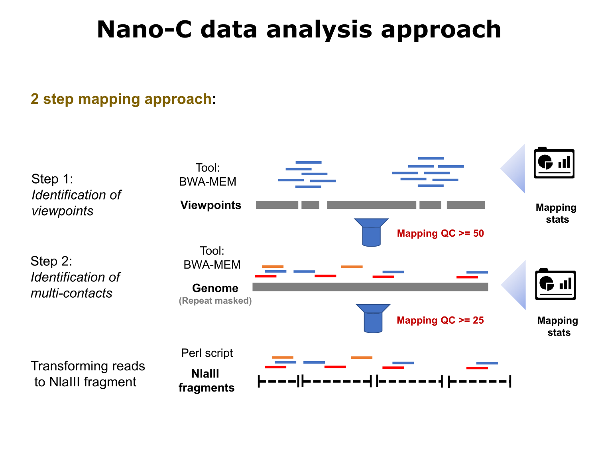
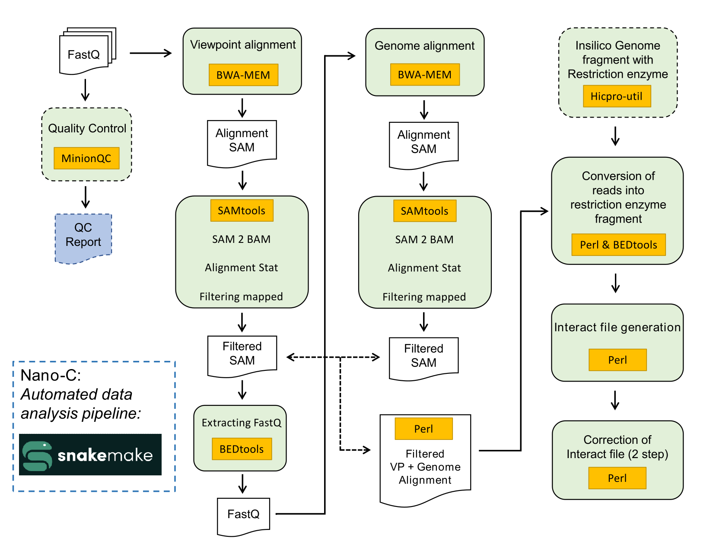

# Nano-C

[](https://img.shields.io/badge/version-1.0.0-blue)

## Bioinformatics pipeline to analyze Nano-C data

## About
Nano-C bioinformatics pipeline allows the user to analyze ONT Direct-RNA sequencing reads derived from Nano-C experiments. This pipeline employs a two-step mapping and filtering approach to accurately and reliably identify contacts within complex 3C reads. This pipeline comprises multiple scripts that all run automatically after the user provides information about the experimental setup and executes in  a single command. The overview of the pipeline is provided below.



Nano-C bioinformatics pipeline aligns the FastQ files using BWA-MEM to a synthetic genome, consisting only of the different viewpoints used in a Nano-C run (for this study the viewpoint sequences were obtained from Mouse genome assembly GRCm38 (mm10), using the BEDTools suite). Aligned reads, containing the viewpoint, are filtered for high mapping quality score (MQ ≥ 50). In the second stage, those high-quality viewpoint containing reads are mapped to the entire mouse genome assembly GRCm38 (mm10) with repeats masked. Further, the individual mapping segments within viewpoint containing reads are filtered for mappings with quality scores over 25 (MQ ≥ 25), thereby mostly removing low-quality inter-chromosomal mappings. The individual segments from each read are then transformed into NlaIII fragments of the mouse genome by merging the read segments that fall in the same or nearby NlaIII fragments using a custom-made Perl script. The total number of multi-contacts within the reads is calculated from the NlaIII-transformed reads, and the multi-contact information is organized according to the UCSC Interact Track Format. The Nano-C bioinformatics pipeline generates UCSC Interact Tracks for each individual viewpoint, which can be uploaded directly to the UCSC genome browser for visualization. 
Nano-C bioinformatics analysis is primarily performed by a mix of custom Perl scripts and several external tools, which are automated using snakemake.

> Note that the documentation is still under construction.

## Software
Here is the list of major external tools and software used in this pipeline.
- [Samtools v1.16.1]( https://github.com/samtools/samtools/releases/tag/1.16.1)
- [BWA v0.7.17]( https://github.com/lh3/bwa/releases/tag/v0.7.17)
- [ BEDTools v2.30.0]( https://github.com/arq5x/bedtools2/releases/tag/v2.30.0)
- [Perl v5.32.1]( https://www.cpan.org/src/README.html)
- [ Seqtk v1.3]( https://github.com/lh3/seqtk/releases/tag/v1.3)
- [Snakemake v 7.20.0]( https://github.com/snakemake/snakemake)
- [Python v3.11.0](https://www.python.org/downloads/release/python-3110/)
- [NumPy v1.24.1]( https://github.com/numpy/numpy)
- [htslib v1.16]( https://github.com/samtools/htslib)

## Installation
The Nano-C bioinformatics pipeline has only been tested on Linux (Ubuntu 20.04), but it should also work on MacOS. Conda must be installed in order to run the Nano-C bioinformatics pipeline, following [these instructions](https://docs.conda.io/projects/conda/en/latest/user-guide/install/) will install conda. We suggest using Miniconda since it is lightweight and provides all the requirements for running the Nano-C bioinformatics pipeline.

To get started, create the conda environment with the YAML file “environment_NanoC.yml. 
```ruby
conda env create -f environment_NanoC.yml
````
This will create the **snakemakeNanoC** environment with all the prerequisite tools and packages.

Next, to check the environment:
```ruby
conda info –envs
```
This should show the newly created conda environment, along with the base and other (if created previously) environments. 

To activate the environment:
```ruby
conda activate snakemakeNanoC
```
Now the environment will be activated and ready to use.

## Usage

Before starting to use the Nano-C bioinformatics pipeline, the directory ‘Snakemake_NanoC’ needs to be downloaded and placed inside the working directory. This ‘Snakemake_NanoC’ directory contains three subdirectories and one Snakefile.

-	scripts 

This subdirectory contains all the custom-made Perl scripts for the analysis.
-	Rules

This subdirectory contains all the snakemake rule files for the pipeline.
-	Input

This subdirectory currently contains two more subdirectories ***ViewpointSeq*** and ***maskedGenome***, for keeping the Mouse genome Fasta and BWA index files respectively. Along with the subdirectoriesm it also contains example input files (except big files i.e., Nano-C FastQ file, Mouse genome assembly Fasta file, BWA index files and genome wide NlaIII fragments file) required for the analysis.

### Required input files
1.	Nano-C FastQ file (merge FastQ file for single run)
2.	Viewpoint sequence file (we used mm10 genome)
3.	Repeat masked Mouse genome (mm10) Fasta file
4.	BWA index file for both Mouse genome and the Viewpoint sequence file
5.	Mouse genome (mm10) chromosome size file
6.	NlaIII fragment file for Mouse genome (mm10)
7.	All the viewpoint location as a BED file

The Nano-C bioinformatics pipeline can be executed as shown below assuming that all necessary input files, script files, and rule files are present at the appropriate location.

```ruby
 snakemake -np   #this will dry-run the Nano-C pipeline 
 snakemake --dag | dot -Tpdf > dagFinalTest1.pdf   #this will create a flow diagram of the Nano-C pipeline
 snakemake --cores 1   #this will execute the Nano-C pipeline
```

Successfully executing the Nano-C bioinformatics pipeline will generate a combined single interact file, containing the multi-contact interactions for each of the viewpoints used in the experiment. 

Viewpoint-specific interact files can be created from the combined file either manually or using *splitting_interact_file.pl* script. Those individual viewpoint-specific files can be uploaded directly to the UCSC Genome Browser for visualization.



Below an overview of the steps involved in the Nano-C bioinformatics pipeline is provided. 
> Note that the two dotted sections in the image are not currently included in the pipeline. These can be executed independently. These features will be included in the pipeline in the next release. see 'Usage' for details _


